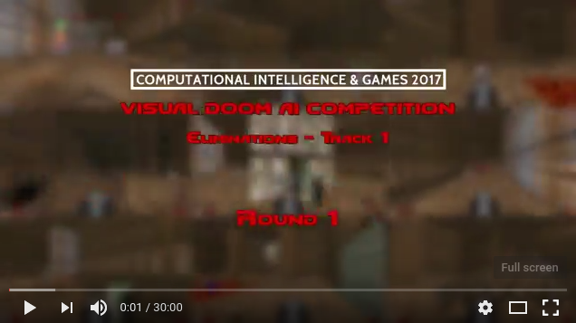
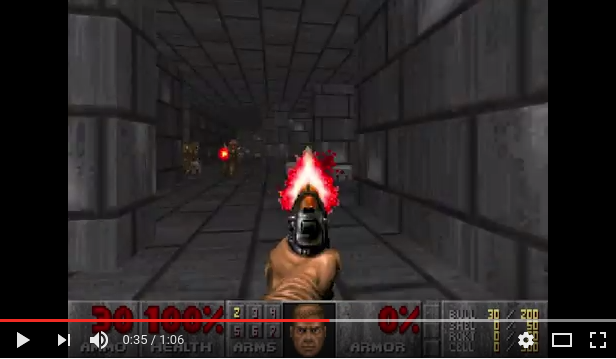
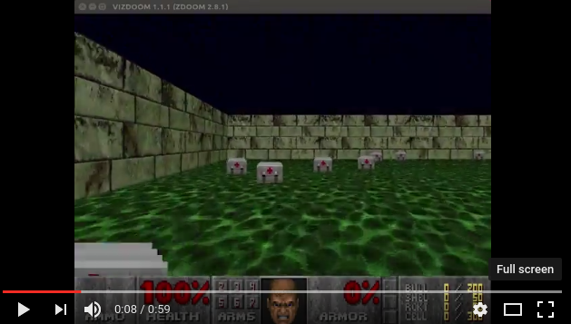
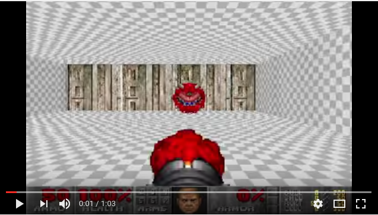
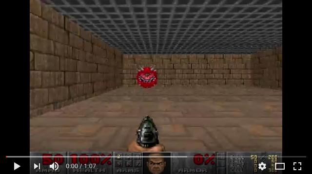

# DoomNet

DoomNet is a [ViZDoom](http://vizdoom.cs.put.edu.pl/) agent trained by reinforcement learning. The agent is a neural network that outputs a probability of actions given only pixels from the screen buffer and set of game variables.

Models:
* [aac.py](aac.py) is an Advantage Actor Critic model. DoomNet's training runs multiple instances of the game in parallel and performs both forward pass and parameter updates on GPU in the main thread. It is faster than A3C on complex models and if number of parallel episodes, batch size, greatly exceeds number of CPUs.
* [aac_lstm.py](aac_lstm.py) is the same as previous model but uses LSTM in place of fully connected layers following CNN.
* [imitation.py](imitation.py) is a model that learns to copy behavior of a human player. The trained weights are used to initialize acc.py or aac_lstm.py.

### Trained models

#### [Visual Doom AI Competition 2017, Elimination Round](http://vizdoom.cs.put.edu.pl/competition-cig-2017), check for DoomNet
Joined work with [Bobby DeSimone](https://github.com/desimone)

#### D3 Battle

#### Health Gathering

#### Rocket Basic

#### Basic

