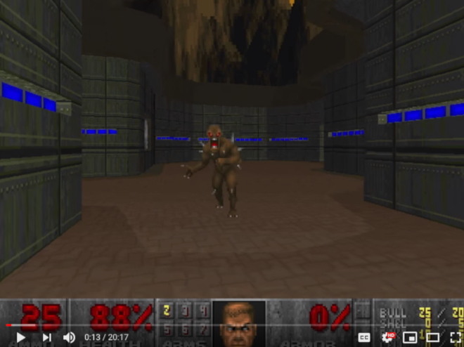
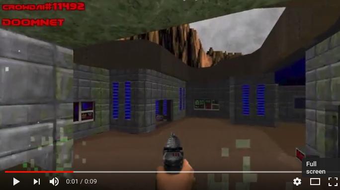
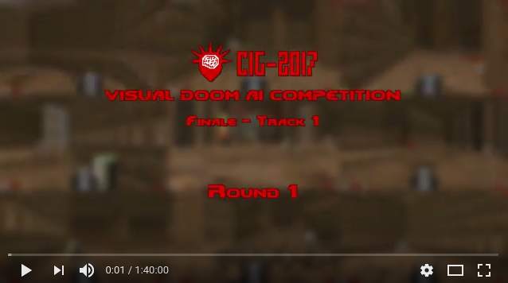

# DoomNet

DoomNet is a [ViZDoom](http://vizdoom.cs.put.edu.pl/) agent trained by reinforcement learning. The agent is a neural network that outputs a probability of actions given only pixels from the screen buffer and set of game variables. DoomNet is a [1st Runner-Up at Visual Doom AI Competition 2018](https://www.youtube.com/watch?v=8YQgtvC4tw8).

#### [What a simple behavior tree can do](https://www.youtube.com/watch?v=IgrCYjpASS8) 

#### [1st Runner-Up at Visual Doom AI Competition 2018](https://www.crowdai.org/challenges/visual-doom-ai-competition-2018-singleplayer-track-1) 

#### [Visual Doom AI Competition 2017](http://vizdoom.cs.put.edu.pl/competition-cig-2017) 
Joint work with [Bobby DeSimone](https://github.com/desimone)

DoomNet's view is at left in the middle row 

#### D3 Battle

#### Health Gathering

#### Rocket Basic

#### Basic

